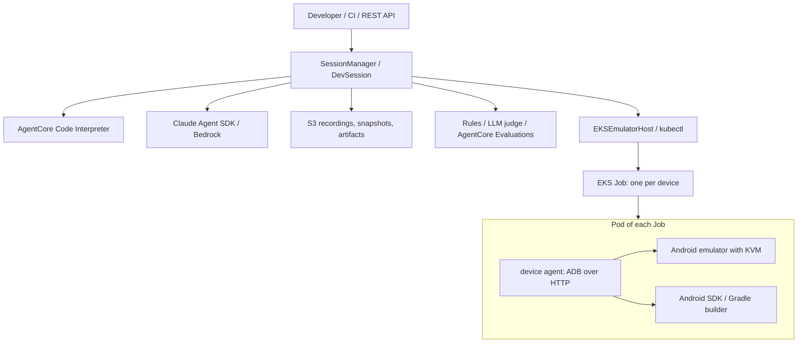

# Code Workflow Emulator on AgentCore + EKS

A Python platform for running a coding agent's work in an isolated environment, keeping a record of what it did, scoring the result, and verifying real Android apps on an emulator. Code execution uses Amazon Bedrock AgentCore Code Interpreter, the agent uses the Claude Agent SDK on Bedrock, the Android device lab runs on Amazon EKS, and the infrastructure is managed with Terraform.

> Demo and sample code. KVM on EKS, app builds, UI interaction, instrumented tests, recording and agent-driven fixes were run on real AWS, most recently on 2026-09-11 against the hardened Terraform; see [the verification report](docs/verification-eks.md). Re-run the confirmation steps in [GUIDE.md](GUIDE.md) §3.5 on any new account before relying on those claims. The REST API shared key and the Kubernetes operator role are a **trusted operator boundary**, not per-user isolation.

## Why this exists

Letting an agent write and run code raises four questions that a plain sandbox does not answer, and each part of this platform exists to answer one of them.

- **Where does the code run, and what can it reach?** An agent needs a Linux environment with the project's packages, environment variables and any external services it depends on. Provisioning that by hand for every run does not scale, and giving the agent a real payment or identity API is not acceptable. So environments are declared once as YAML profiles, provisioned into a fresh AgentCore Code Interpreter session, and external dependencies are stood in for by mock HTTP services inside the sandbox.
- **What did the agent actually do?** Reviewing a pull request is not enough when the agent also ran commands, installed packages and tapped through an app. Every execution, message, written file and screenshot is written as JSONL and artifacts to S3 or a local directory. A closed session can be replayed offline and re-scored later without the sandbox.
- **Did it succeed, by whose account?** An agent's own summary is not evidence. Scoring combines deterministic rules, an LLM judge that sees the transcript, and an optional AgentCore Evaluations pass. The harness runs the verification command itself, optionally in a fresh session restored from a snapshot, and ignores what the agent claims.
- **Does the app work on a device?** Mobile changes cannot be verified with unit tests alone. Code Interpreter has no KVM and cannot host an emulator, so a separate device lab on EKS provides one emulator per Job with screenshots, UI dumps, input, installs, instrumented tests, screen recording and a live view.

The EKS lab and the surrounding plumbing exist because Code Interpreter has no KVM, no custom images and no managed session storage; those gaps are tracked as product feature requests outside this repository.

## Architecture



- Everything passes through `DevSession`, so every command, file write and device action is recorded the same way whether a person, a CI job or the agent issued it.
- A dedicated managed node group runs Android workloads on `m8i.2xlarge` by default, with nested virtualization enabled in the launch template. A KVM device plugin advertises one `devic.es/kvm` slot per node.
- Each device is one Job whose Pod holds three containers sharing a network namespace and an `emptyDir`: the emulator, the device agent, and the Gradle builder. No container is privileged, and none mounts a Docker socket or a host path. Only the node-level device plugin DaemonSet is privileged.
- Each Job has a lifetime deadline and a TTL after completion. Its authentication token lives in a Kubernetes Secret owned by the Job, so the Secret is garbage collected with it. Jobs are deleted on a clean shutdown, and the deadline still applies if the calling process dies.

See [architecture](docs/architecture.md) for the design and [GUIDE.md](GUIDE.md) for deployment and operations.

## What you get

- **Environments**: YAML profiles declare packages, environment variables, setup commands and mock HTTP services, so a run starts from a known state every time.
- **Recording and replay**: executions, messages, written file contents and artifacts are written as JSONL to S3 or a local directory. `ReplaySandbox` replays them offline and `open_recorded` re-scores a closed session from the record alone.
- **Evaluation**: deterministic rules, an LLM judge, and AgentCore Evaluations. The harness runs `verify_command` itself, optionally against a snapshot restored into a fresh session.
- **Agent harness**: `cwe_mcp_server` exposes session tools to the Claude Agent SDK and `cwe_hooks` enforces a run budget of executions, wall clock and cost. Tool output is summarized into the model's context while the full output stays in the recording. Every run records tokens, an estimated cost and a trace id so runs can be compared.
- **Android**: screenshots, UI dumps, tap, swipe, text, key, install, launch, logcat, instrumented tests, screen recording, live view and Gradle builds. `count` and `images` create several Jobs, selected with `device.for_device(i)`.
- **Around the loop**: profile proposal from a Gradle project, skills distilled from successful runs and loaded only after a person approves them, and PR comments that attach the run's evidence.

## Quick start

Install the package and confirm the offline suite passes before touching AWS. `uv` is used here; `python -m venv` and `pip install -e '.[dev]'` work as well.

```bash
uv venv --python 3.12 .venv && source .venv/bin/activate
uv pip install -e '.[dev]'
python -m pytest -q                      # 90 tests, no AWS needed
```

Deployment is three Terraform roots plus an image build. Each root needs a `terraform.tfvars` filled from its `terraform.tfvars.example`; [GUIDE.md](GUIDE.md) walks through every value.

```bash
./scripts/deploy.sh --stage storage --apply
./scripts/deploy.sh --stage foundation --apply
# point kubectl at the new cluster (GUIDE.md §3.2), then:
./scripts/deploy.sh --stage platform --apply
./scripts/deploy.sh --stage images --tag v1
set -a; source .env.eks; set +a

python examples/quickstart.py            # sandbox only, about one minute
python examples/quickstart.py --agent    # adds an agent run, several minutes and a few cents of Bedrock usage
python examples/android_quickstart.py    # boots an emulator on EKS, several minutes on first pull
```

Without `--apply` the script only produces a Terraform plan.

## Security model

- **Cluster**: the EKS API is private by default; a public endpoint requires an explicit fixed CIDR and `0.0.0.0/0` is rejected. Kubernetes Secrets are envelope-encrypted with a customer-managed KMS key, so revoking the key revokes the session tokens. Control-plane audit logging is on. Nodes require IMDSv2 with hop limit 1, encrypted root volumes and no world-open ingress.
- **Workloads**: the lab namespace enforces the `baseline` Pod Security Standard. Session containers drop all capabilities, disable privilege escalation, use the default seccomp profile, mount no host path, and have service account token automounting turned off. `/dev/kvm` is granted through the device plugin resource, not privileged mode.
- **Network**: the lab namespace denies all traffic by default. Device Pods are then allowed DNS plus public HTTPS only, excluding private, carrier-grade NAT and link-local ranges, so a build reaches neither instance metadata nor other cluster services. Ingress to port 8080 is allowed only from explicitly labelled in-cluster orchestrator Pods. Nothing is published through a Service, Ingress or load balancer.
- **Device authentication**: the agent refuses to start without a token, compares it in constant time, requires it on every endpoint except `/healthz`, and binds each host to one session id. The live view exchanges a single-use, short-lived viewer token for an `HttpOnly` cookie rather than exposing the token in a URL, and that cookie opens only the viewer paths — screen, tap, swipe, text and key — never the device shell, install or build. Downloads are HTTPS-only and are re-checked against private, loopback and link-local addresses after every redirect. Local access is a `kubectl port-forward` bound to `127.0.0.1`.
- **Build isolation**: the builder sidecar receives only a build id, Gradle task names and a timeout. Containers in a Pod share a network namespace, so loopback is not a trust boundary: the builder requires its own credential from the Job's Secret and holds no device token, no cluster credentials, no Docker socket and no KVM device. Gradle task names are validated and passed as argv, never through a shell, and source archives are extracted with a filter that rejects path escapes. Build scripts are the customer's own code and run in the same session as the device they build for; the Pod is one trust domain per session, not a boundary between the build and the emulator.
- **Agent and API**: agent runs always carry a budget, the tool allowlist is closed (`dontAsk`, and `bypassPermissions` is refused), and credential-shaped variables are blanked before the agent process starts. The REST API binds `127.0.0.1` unless `CWE_API_KEY` is set, caps request bodies, and accepts only server-generated session and snapshot ids. Profile environment values are written to a file inside the sandbox and never appear in commands, recordings, transcripts, judge prompts or the stored session metadata.
- **Storage**: the recordings bucket blocks public access, keeps versions, is encrypted, and refuses any request not made over TLS. Both the sandbox execution role and the operator role are confined to one key prefix of it.
- **Trust boundary**: an operator can create Jobs in the lab namespace, which is equivalent to mounting and reading any Secret in that namespace. Operators are trusted. For multi-user isolation, give each user their own namespace and role, or put AgentCore Runtime and Identity in front. The emulator container runs as root inside its own container, which `baseline` permits and `restricted` would not; container isolation is not a boundary against hostile code. The sandbox and the device Pods can reach any public HTTPS host, so an agent misled by repository content could send workspace contents outward; the system prompt forbids it, and an egress allowlist is the hardening step for production.

## Layout

- `src/cwe/`: sessions, sandbox, agent, evaluation, recording, REST API and CLI. `eks.py` is the EKS backend; `android.py` holds the shared device client.
- `device_agent/`: the ADB HTTP service, the in-Pod Gradle builder, and both Dockerfiles.
- `infra/terraform/`: the three Terraform roots. `infra/build_images.py` builds the images and writes the environment file. `infra/verify_eks_security.py` checks a live deployment.
- `examples/`: the mock payment API example, agent integration examples, the Android sample app and framework profiles.
- `tests/`: regression tests that run without AWS.
- `infra/cfn/`, `scripts/legacy/`, `docs/legacy/`: the earlier EC2 and CloudFormation deployment, kept for existing installations. Its documents are in Korean and are not part of this release.

## Limits

- `android_max_size` is an upper bound; no autoscaler is installed. Set `android_desired_size` to the number of concurrent devices you need. One node serves one emulator Pod.
- Warm AMI baking and pre-booted emulator pools from the EC2 path were not ported. `cwe android-pool`, `infra/bake_ami.py` and `scripts/build_emulator_image.sh` belong to that legacy path.
- The build cache lives for the life of the Pod. Deleting the Pod deletes the cache and any APK working files, so persist evidence to the recording store before shutdown.
- The emulator image comes from Google's public emulator container project. `deploy.sh --stage images --mirror-emulator` copies it into the `android-emulator` ECR repository under an immutable tag and sets `CWE_ANDROID_EMULATOR_IMAGE`; without that variable the code falls back to the public image's mutable `latest` tag.
- The EKS control plane and ready nodes cost money even when no session is running. Check per-region pricing and vCPU quotas before deploying.
- Package metadata allows Python 3.11 or later, but development, tests and containers target Python 3.12.

## Clean up

```bash
./scripts/cleanup.sh          # plan
./scripts/cleanup.sh --apply  # destroy platform, then foundation; the recording bucket is kept
```

Stop running work first. ECR images are deleted with the foundation. The recording bucket is protected by a separate state and `prevent_destroy`. Existing CloudFormation stacks are not touched.
