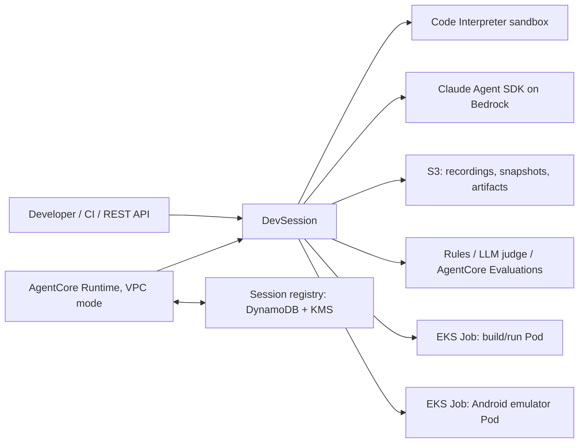

# AgentCore Code Workbench

Run a coding agent on Amazon Bedrock AgentCore and still build, run and verify software that a microVM cannot hold. The agent orchestrates from AgentCore (Code Interpreter for the sandbox, Runtime for hosting). Anything heavy runs in a session-owned Pod on Amazon EKS: a Gradle build of a large Java service, the service itself under integration tests, or an Android emulator. Every action is recorded, the result is scored, and the infrastructure is Terraform.

> Reference architecture with a working proof, not a hosted product. Verified on real AWS in us-east-1: Android device lab on 2026-09-11 ([report](docs/verification-eks.md)), workload Pods, Runtime in VPC mode and reattach after a microVM swap on 2026-09-14 ([report](docs/verification-workload.md)). The REST API key and the Kubernetes operator role are a trusted operator boundary, not per-user isolation.

## The problem

A Code Interpreter microVM is fixed at 2 vCPU, 8 GB of memory and 10 GB of disk; a Runtime microVM has the same 2 vCPU and 8 GB with 1 GB of session storage. None of these limits can be raised. Runtime Instances (EC2-backed) are offered in nine regions and not in Seoul. Large builds fail there with out-of-memory and out-of-disk errors, and an emulator cannot run there at all because there is no KVM.

The answer is not to build in the microVM. The agent stays on AgentCore; a `WorkloadProfile` gives its session one EKS Pod with the CPU, memory, disk and toolchain image the job needs, and the agent drives it through tools. The same mechanism runs one Android emulator per Job on a KVM-enabled node group.

## Architecture



- **Sandbox**: YAML profiles provision a fresh Code Interpreter session with packages, environment and mock HTTP services. The agent edits and runs small things here.
- **Workload Pod**: `session.start_workload(WorkloadProfile(memory="32Gi", ephemeral_storage="200Gi"))`. Your toolchain image plus a small in-Pod agent; the agent gets `remote_shell`, `remote_start`/`remote_logs`/`remote_stop`, `remote_probe`, file tools and `remote_sync_workspace`. The same operations are REST endpoints and Runtime actions.
- **Android**: one emulator per Job on `m8i` nodes with nested virtualization. Screenshots, UI dumps, input, installs, instrumented tests, screen recording and a live view.
- **Sticky sessions**: AgentCore Runtime replaces a microVM after the idle timeout. A registry records the sandbox session and the Pods, so the next microVM reattaches instead of starting over. With DynamoDB each invocation holds a lease on its runtime session, so two cold processes cannot each create an environment.
- **Recording and evaluation**: every command, file, device action and remote command is JSONL plus artifacts in S3. A closed session replays offline and is re-scored by rules, an LLM judge and optionally AgentCore Evaluations. The harness runs the verification command itself.

Design details are in [docs/architecture.md](docs/architecture.md).

## Quick start

```bash
uv venv --python 3.12 .venv && source .venv/bin/activate
uv pip install -e '.[dev]'
python -m pytest -q                      # 126 tests, no AWS needed

./scripts/deploy.sh --stage storage --apply
./scripts/deploy.sh --stage foundation --apply       # then point kubectl at the cluster (GUIDE.md 3.2)
./scripts/deploy.sh --stage platform --apply
./scripts/deploy.sh --stage images --tag v1 --workload --runtime
set -a; source .env.eks; set +a

python examples/workload_demo.py         # Java service built, run and probed on a workload Pod
python examples/android_quickstart.py    # emulator on EKS
./scripts/deploy.sh --stage runtime --apply          # optional: agent on AgentCore Runtime with sticky sessions
```

Each Terraform root needs a `terraform.tfvars`; [GUIDE.md](GUIDE.md) walks through every value, the verification steps, operations and teardown.

## Security in one paragraph

Private EKS API by default, Secrets envelope-encrypted with a customer-managed KMS key, IMDSv2 with hop limit 1. Session Pods run as uid 1000 with all capabilities dropped, no service account token, no host namespaces, and a read-only root filesystem for the workload container. The namespace is default-deny; Pods reach DNS and public HTTPS only, so a build reaches neither instance metadata nor other cluster services, and only the orchestrator reaches the Pod on port 8080 with a per-Job bearer token. The Runtime sits in private subnets with PrivateLink or NAT. Registry records are KMS-sealed and bound to their runtime session id. Agent runs carry a budget, the tool list is closed, and the LLM judge treats the transcript as untrusted data. The full model and its trust boundary are in [docs/architecture.md](docs/architecture.md) and GUIDE.md section 6.

## Known gaps

One namespace and one operator role (no per-user tenancy). Workspaces and build caches live in `emptyDir` and vanish with the Pod. No built-in Git credential path to the Pod. No autoscaler. Pod egress is public HTTPS only, so internal artifact repositories need an explicit rule. The agent loop is the Claude Agent SDK; the tool layer is MCP and can serve another agent, but no other adapter ships. Verified in us-east-1 only; Seoul prerequisites are checked in GUIDE.md section 8.

## Layout

`src/cwe/` sessions, sandbox, agent, evaluation, recording, REST API, CLI, EKS hosts (`eks.py`, `workload.py`, `workload_agent.py`), registry, Runtime entry point. `device_agent/` Android device agent, Gradle builder and the workload Dockerfile. `runtime/` the Runtime image. `infra/terraform/` four roots: `storage`, `foundation`, `platform`, `runtime`. `examples/` quick starts, the Java service and Android samples, Runtime demo. `tests/` offline regression suite. `docs/legacy/`, `scripts/legacy/`, `infra/cfn/` the earlier EC2 and CloudFormation path.

## Clean up

```bash
cwe reap --apply --max-age-hours 0
./scripts/cleanup.sh --apply   # runtime, platform, foundation; the recording bucket is kept
```
